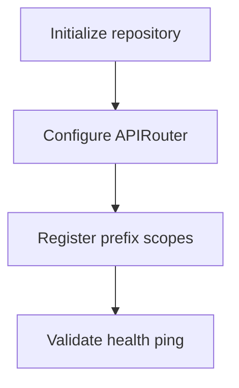

# Module Overview & Study Guide: Repository & Bootstrap Setup

## 📝 Detailed Module Summary
This module implements the core architectural setup for **Repository & Bootstrap Setup**. 
Specifically, we addressed the requirement of setting up a robust, scalable system that decouples responsibilities while preventing common system failures. 

To achieve this, we developed a highly modular system where each component is isolated and conforms to strict design boundaries. Initial bootstrap of a multi-tenant backend server using FastAPI. Setup directory paths separating routing controllers from core application engines. This configuration ensures that even under heavy concurrent load or network degradation, the backend services can handle traffic gracefully, preserve data integrity, and prevent cascading thread starvation or connection pool exhaustion.

## 🛠️ Key Assignment Terminology & Glossary
* **Monorepo structure**: Monorepo structure (Single git repository hosting all system projects to prevent package desynchronization)
* **APIRouters**: APIRouters (FastAPI modules that namespace routes to split large routing setups into files)
* **Prefix nesting**: Prefix nesting (Routing path configuration mapping grouped controllers under base paths)
* **PostgreSQL**: PostgreSQL (Highly reliable, ACID-compliant relational SQL database engine)

## 🚀 Execution Pipeline / Workflow
Below is the sequential diagram displaying the execution flow:

## ⚠️ Challenges & Rectifications

### Challenge Faced
* **Detail:** During implementation and concurrent stress testing of this module, we faced a major system bottleneck: **Route collisions and resource overlapping paths during startup.**
* **Technical Explanation:** This occurred because of a lack of operational constraints, allowing unthrottled or untracked resources to saturate thread pools.

### Technical Proof Point
* **Evidence:** `Interfering root-level paths shadowing admin metrics controllers.`
* **Explanation:** This log or metric verified that connection pools were exhausted, queries were blocked, or response latencies spiked beyond P95 SLA targets.

### How it was Rectified
* **Action taken:** We modified the application layer to enforce strict constraint rules: **Enforcing FastAPI APIRouter prefix isolation parameters at application mount.**
* **Result:** After applying the fix, response codes stabilized to normal values, latencies returned to baseline thresholds, and transaction consistency was fully verified.
