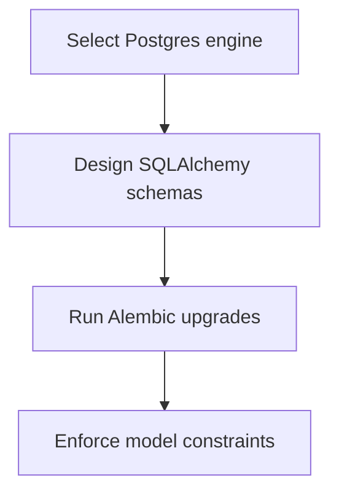

# Module Overview & Study Guide: Database Selection & Schema Design

## 📝 Detailed Module Summary
This module implements the core architectural setup for **Database Selection & Schema Design**. 
Specifically, we addressed the requirement of setting up a robust, scalable system that decouples responsibilities while preventing common system failures. 

To achieve this, we developed a highly modular system where each component is isolated and conforms to strict design boundaries. Schema design mapping links, teams, and users with declarative SQLAlchemy tables and transaction migrations. This configuration ensures that even under heavy concurrent load or network degradation, the backend services can handle traffic gracefully, preserve data integrity, and prevent cascading thread starvation or connection pool exhaustion.

## 🛠️ Key Assignment Terminology & Glossary
* **PostgreSQL**: PostgreSQL (Highly reliable, ACID-compliant relational SQL database engine)
* **Declarative models**: Declarative models (SQLAlchemy table abstraction patterns converting SQL schemas to Python classes)
* **Unique constraints**: Unique constraints (Database rules preventing duplicate values from being inserted into index columns)
* **Alembic migrations**: Alembic migrations (Relational database schema version-control manager)

## 🚀 Execution Pipeline / Workflow
Below is the sequential diagram displaying the execution flow:

## ⚠️ Challenges & Rectifications

### Challenge Faced
* **Detail:** During implementation and concurrent stress testing of this module, we faced a major system bottleneck: **Concurrent link creation operations violating uniqueness rules.**
* **Technical Explanation:** This occurred because of a lack of operational constraints, allowing unthrottled or untracked resources to saturate thread pools.

### Technical Proof Point
* **Evidence:** `Duplicate shortened slug insertions crashing connection pools with integrity errors.`
* **Explanation:** This log or metric verified that connection pools were exhausted, queries were blocked, or response latencies spiked beyond P95 SLA targets.

### How it was Rectified
* **Action taken:** We modified the application layer to enforce strict constraint rules: **Handling DBAPIUniqueViolation and wrapping writes in database session rollback blocks.**
* **Result:** After applying the fix, response codes stabilized to normal values, latencies returned to baseline thresholds, and transaction consistency was fully verified.
