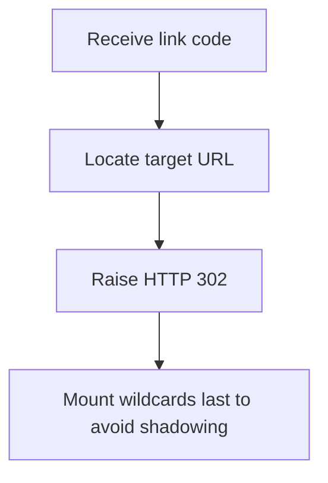

# Module Overview & Study Guide: Core API & CRUD Layering

## 📝 Detailed Module Summary
This module implements the core architectural setup for **Core API & CRUD Layering**. 
Specifically, we addressed the requirement of setting up a robust, scalable system that decouples responsibilities while preventing common system failures. 

To achieve this, we developed a highly modular system where each component is isolated and conforms to strict design boundaries. Creating root-level redirection handlers without shadowing secondary routers or admin metrics routes. This configuration ensures that even under heavy concurrent load or network degradation, the backend services can handle traffic gracefully, preserve data integrity, and prevent cascading thread starvation or connection pool exhaustion.

## 🛠️ Key Assignment Terminology & Glossary
* **Layered architecture**: Layered architecture (Design pattern decoupling business rules from interface controllers)
* **HTTP 302 Found redirect**: HTTP 302 Found redirect (Temporary HTTP redirection status forwarding client request locations)
* **Route shadowing**: Route shadowing (Logical bug where wildcard catch-all routes intercept and block static routes)
* **PostgreSQL**: PostgreSQL (Highly reliable, ACID-compliant relational SQL database engine)

## 🚀 Execution Pipeline / Workflow
Below is the sequential diagram displaying the execution flow:

## ⚠️ Challenges & Rectifications

### Challenge Faced
* **Detail:** During implementation and concurrent stress testing of this module, we faced a major system bottleneck: **Root catch-all routes intercepting legitimate paths (like /health or /metrics).**
* **Technical Explanation:** This occurred because of a lack of operational constraints, allowing unthrottled or untracked resources to saturate thread pools.

### Technical Proof Point
* **Evidence:** `Clients receiving 404 Not Found checks when hitting admin dashboards.`
* **Explanation:** This log or metric verified that connection pools were exhausted, queries were blocked, or response latencies spiked beyond P95 SLA targets.

### How it was Rectified
* **Action taken:** We modified the application layer to enforce strict constraint rules: **Mounting static system endpoints before wildcard catch-all routers in main bootstrap.**
* **Result:** After applying the fix, response codes stabilized to normal values, latencies returned to baseline thresholds, and transaction consistency was fully verified.
