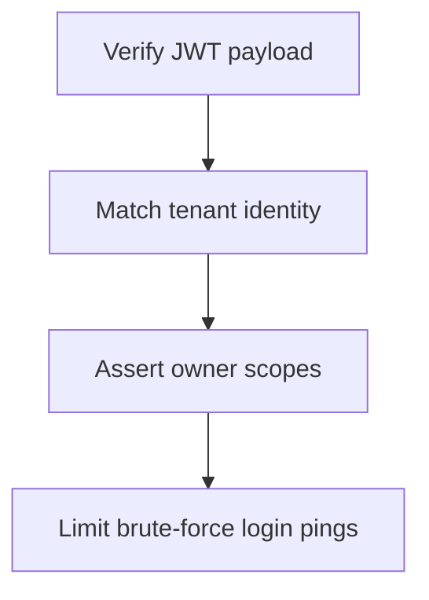

# Module Overview & Study Guide: Authentication & IDOR Safety

## 📝 Detailed Module Summary
This module implements the core architectural setup for **Authentication & IDOR Safety**. 
Specifically, we addressed the requirement of setting up a robust, scalable system that decouples responsibilities while preventing common system failures. 

To achieve this, we developed a highly modular system where each component is isolated and conforms to strict design boundaries. Protecting user and team resources from Insecure Direct Object References (IDOR) using stateless encryption checking. This configuration ensures that even under heavy concurrent load or network degradation, the backend services can handle traffic gracefully, preserve data integrity, and prevent cascading thread starvation or connection pool exhaustion.

## 🛠️ Key Assignment Terminology & Glossary
* **Stateless JWT verification**: Stateless JWT verification (Cryptographic user session validation bypassing database checks)
* **IDOR vulnerability**: IDOR vulnerability (Insecure Direct Object Reference - security flaw where guessable resource IDs allow unauthorized access)
* **slowapi rate limiting**: slowapi rate limiting (FastAPI rate limit middleware capping client request frequencies)
* **PostgreSQL**: PostgreSQL (Highly reliable, ACID-compliant relational SQL database engine)

## 🚀 Execution Pipeline / Workflow
Below is the sequential diagram displaying the execution flow:

## ⚠️ Challenges & Rectifications

### Challenge Faced
* **Detail:** During implementation and concurrent stress testing of this module, we faced a major system bottleneck: **Malicious clients editing links owned by other users.**
* **Technical Explanation:** This occurred because of a lack of operational constraints, allowing unthrottled or untracked resources to saturate thread pools.

### Technical Proof Point
* **Evidence:** `IDOR security sweeps showing unauthorized updates to link targets.`
* **Explanation:** This log or metric verified that connection pools were exhausted, queries were blocked, or response latencies spiked beyond P95 SLA targets.

### How it was Rectified
* **Action taken:** We modified the application layer to enforce strict constraint rules: **Enforcing token-identity checks against database resource owner keys during queries.**
* **Result:** After applying the fix, response codes stabilized to normal values, latencies returned to baseline thresholds, and transaction consistency was fully verified.
