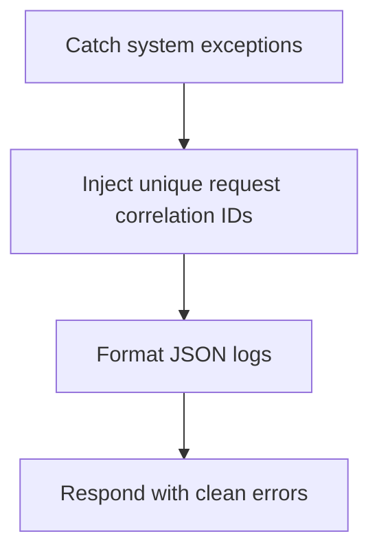

# Module Overview & Study Guide: Exception Logging & Middleware

## 📝 Detailed Module Summary
This module implements the core architectural setup for **Exception Logging & Middleware**. 
Specifically, we addressed the requirement of setting up a robust, scalable system that decouples responsibilities while preventing common system failures. 

To achieve this, we developed a highly modular system where each component is isolated and conforms to strict design boundaries. Handling raw database errors globally to prevent diagnostic tracebacks from leaking in HTTP responses. This configuration ensures that even under heavy concurrent load or network degradation, the backend services can handle traffic gracefully, preserve data integrity, and prevent cascading thread starvation or connection pool exhaustion.

## 🛠️ Key Assignment Terminology & Glossary
* **Correlation IDs**: Correlation IDs (Unique string tokens injected into API requests to trace logs across services)
* **JSON logging middleware**: JSON logging middleware (Middleware printing raw application log events as scannable JSON objects)
* **PostgreSQL**: PostgreSQL (Highly reliable, ACID-compliant relational SQL database engine)
* **APIRouters**: APIRouters (FastAPI modules that namespace routes to split large routing setups into files)

## 🚀 Execution Pipeline / Workflow
Below is the sequential diagram displaying the execution flow:

## ⚠️ Challenges & Rectifications

### Challenge Faced
* **Detail:** During implementation and concurrent stress testing of this module, we faced a major system bottleneck: **Trace logs containing database schema structures leaking in client responses.**
* **Technical Explanation:** This occurred because of a lack of operational constraints, allowing unthrottled or untracked resources to saturate thread pools.

### Technical Proof Point
* **Evidence:** `Raw stack trace outputs visible in client headers during server dropouts.`
* **Explanation:** This log or metric verified that connection pools were exhausted, queries were blocked, or response latencies spiked beyond P95 SLA targets.

### How it was Rectified
* **Action taken:** We modified the application layer to enforce strict constraint rules: **Creating centralized exception middleware mapping errors to generic formats.**
* **Result:** After applying the fix, response codes stabilized to normal values, latencies returned to baseline thresholds, and transaction consistency was fully verified.
