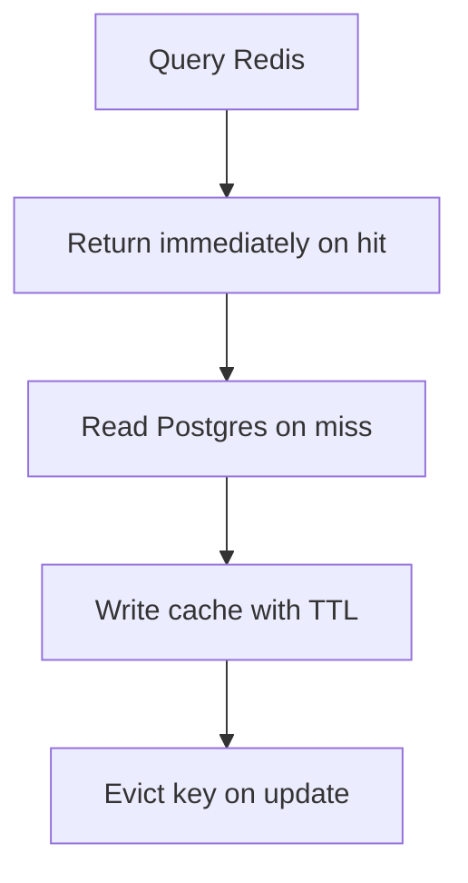

# Module Overview & Study Guide: Redis Caching Integration

## 📝 Detailed Module Summary
This module implements the core architectural setup for **Redis Caching Integration**. 
Specifically, we addressed the requirement of setting up a robust, scalable system that decouples responsibilities while preventing common system failures. 

To achieve this, we developed a highly modular system where each component is isolated and conforms to strict design boundaries. Cache-Aside pattern implementation caching shortened link lookups to reduce PostgreSQL load. This configuration ensures that even under heavy concurrent load or network degradation, the backend services can handle traffic gracefully, preserve data integrity, and prevent cascading thread starvation or connection pool exhaustion.

## 🛠️ Key Assignment Terminology & Glossary
* **Cache-Aside strategy**: Cache-Aside strategy (Caching pattern querying cache first, reading DB on miss, and writing back to cache)
* **Redis TTL invalidation**: Redis TTL invalidation (Automated cache key eviction using Time-To-Live limits)
* **PostgreSQL**: PostgreSQL (Highly reliable, ACID-compliant relational SQL database engine)
* **HTTP 302 Found redirect**: HTTP 302 Found redirect (Temporary HTTP redirection status forwarding client request locations)

## 🚀 Execution Pipeline / Workflow
Below is the sequential diagram displaying the execution flow:

## ⚠️ Challenges & Rectifications

### Challenge Faced
* **Detail:** During implementation and concurrent stress testing of this module, we faced a major system bottleneck: **Cache poisoning and stale reads when targets are edited in database.**
* **Technical Explanation:** This occurred because of a lack of operational constraints, allowing unthrottled or untracked resources to saturate thread pools.

### Technical Proof Point
* **Evidence:** `Redirects resolving to old targets even after database records were updated.`
* **Explanation:** This log or metric verified that connection pools were exhausted, queries were blocked, or response latencies spiked beyond P95 SLA targets.

### How it was Rectified
* **Action taken:** We modified the application layer to enforce strict constraint rules: **Triggering synchronous invalidation commands on Redis database keys inside write actions.**
* **Result:** After applying the fix, response codes stabilized to normal values, latencies returned to baseline thresholds, and transaction consistency was fully verified.
