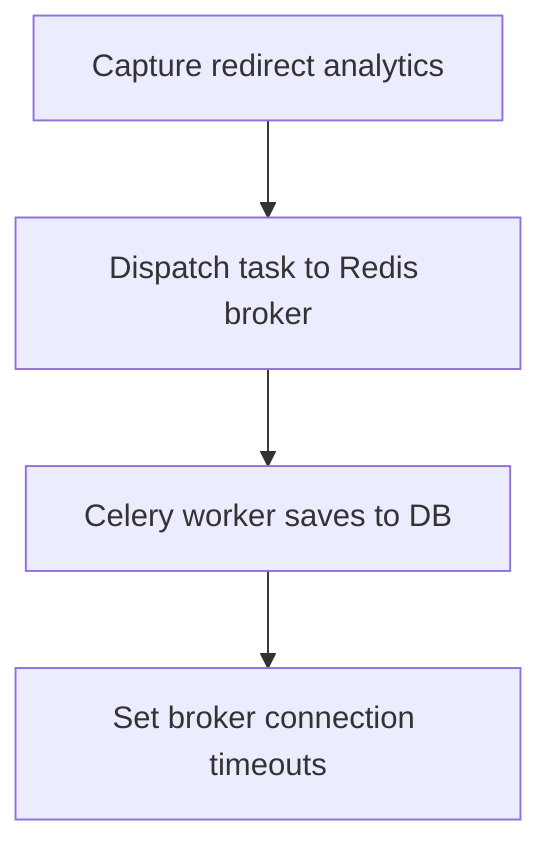

# Module Overview & Study Guide: Decoupled Background Tasks

## 📝 Detailed Module Summary
This module implements the core architectural setup for **Decoupled Background Tasks**. 
Specifically, we addressed the requirement of setting up a robust, scalable system that decouples responsibilities while preventing common system failures. 

To achieve this, we developed a highly modular system where each component is isolated and conforms to strict design boundaries. Decoupling slow analytics and writes from client requests using an event-driven task worker queue. This configuration ensures that even under heavy concurrent load or network degradation, the backend services can handle traffic gracefully, preserve data integrity, and prevent cascading thread starvation or connection pool exhaustion.

## 🛠️ Key Assignment Terminology & Glossary
* **Celery worker**: Celery worker (Asynchronous background task runner executing slow operations out-of-band)
* **Redis broker**: Redis broker (High-speed message queue passing execution parameters to background workers)
* **PostgreSQL**: PostgreSQL (Highly reliable, ACID-compliant relational SQL database engine)
* **Layered architecture**: Layered architecture (Design pattern decoupling business rules from interface controllers)

## 🚀 Execution Pipeline / Workflow
Below is the sequential diagram displaying the execution flow:

## ⚠️ Challenges & Rectifications

### Challenge Faced
* **Detail:** During implementation and concurrent stress testing of this module, we faced a major system bottleneck: **Redis task broker network dropouts blocking the core redirect path.**
* **Technical Explanation:** This occurred because of a lack of operational constraints, allowing unthrottled or untracked resources to saturate thread pools.

### Technical Proof Point
* **Evidence:** `API threads getting locked waiting for task dispatch confirmation during outages.`
* **Explanation:** This log or metric verified that connection pools were exhausted, queries were blocked, or response latencies spiked beyond P95 SLA targets.

### How it was Rectified
* **Action taken:** We modified the application layer to enforce strict constraint rules: **Wrapping broker calls in timeout blocks to log errors and fail open.**
* **Result:** After applying the fix, response codes stabilized to normal values, latencies returned to baseline thresholds, and transaction consistency was fully verified.
