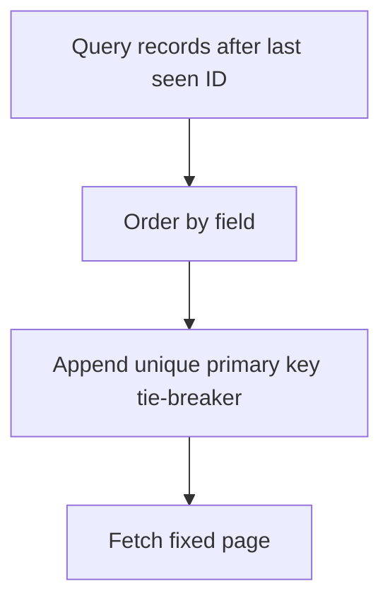

# Module Overview & Study Guide: Stable Keyset Pagination

## 📝 Detailed Module Summary
This module implements the core architectural setup for **Stable Keyset Pagination**. 
Specifically, we addressed the requirement of setting up a robust, scalable system that decouples responsibilities while preventing common system failures. 

To achieve this, we developed a highly modular system where each component is isolated and conforms to strict design boundaries. Designing stable pagination parameters preventing record duplication or performance drops at high offsets. This configuration ensures that even under heavy concurrent load or network degradation, the backend services can handle traffic gracefully, preserve data integrity, and prevent cascading thread starvation or connection pool exhaustion.

## 🛠️ Key Assignment Terminology & Glossary
* **Keyset paging**: Keyset paging (High-performance pagination scanning values after a specific cursor key)
* **Offset latency scaling**: Offset latency scaling (Database query bottleneck where high offsets require scanning all previous rows)
* **PostgreSQL**: PostgreSQL (Highly reliable, ACID-compliant relational SQL database engine)
* **Unique constraints**: Unique constraints (Database rules preventing duplicate values from being inserted into index columns)

## 🚀 Execution Pipeline / Workflow
Below is the sequential diagram displaying the execution flow:

## ⚠️ Challenges & Rectifications

### Challenge Faced
* **Detail:** During implementation and concurrent stress testing of this module, we faced a major system bottleneck: **Unstable pagination skipping rows when sorting by non-unique columns.**
* **Technical Explanation:** This occurred because of a lack of operational constraints, allowing unthrottled or untracked resources to saturate thread pools.

### Technical Proof Point
* **Evidence:** `Identical timestamps returning duplicate rows across paginated screens.`
* **Explanation:** This log or metric verified that connection pools were exhausted, queries were blocked, or response latencies spiked beyond P95 SLA targets.

### How it was Rectified
* **Action taken:** We modified the application layer to enforce strict constraint rules: **Appending the primary key ID as a sorting tie-breaker to all order queries.**
* **Result:** After applying the fix, response codes stabilized to normal values, latencies returned to baseline thresholds, and transaction consistency was fully verified.
