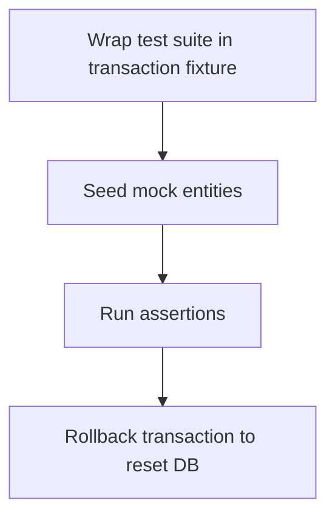

# Module Overview & Study Guide: Database Constraint Safety

## 📝 Detailed Module Summary
This module implements the core architectural setup for **Database Constraint Safety**. 
Specifically, we addressed the requirement of setting up a robust, scalable system that decouples responsibilities while preventing common system failures. 

To achieve this, we developed a highly modular system where each component is isolated and conforms to strict design boundaries. Isolating integration tests by running each run within automatic transaction rollback scopes. This configuration ensures that even under heavy concurrent load or network degradation, the backend services can handle traffic gracefully, preserve data integrity, and prevent cascading thread starvation or connection pool exhaustion.

## 🛠️ Key Assignment Terminology & Glossary
* **Rollback fixtures**: Rollback fixtures (Testing configuration wrapping all runs in auto-rolled-back transactions)
* **PostgreSQL**: PostgreSQL (Highly reliable, ACID-compliant relational SQL database engine)
* **Declarative models**: Declarative models (SQLAlchemy table abstraction patterns converting SQL schemas to Python classes)
* **Unique constraints**: Unique constraints (Database rules preventing duplicate values from being inserted into index columns)

## 🚀 Execution Pipeline / Workflow
Below is the sequential diagram displaying the execution flow:

## ⚠️ Challenges & Rectifications

### Challenge Faced
* **Detail:** During implementation and concurrent stress testing of this module, we faced a major system bottleneck: **Stale row database records left by previous tests causing subsequent runs to fail.**
* **Technical Explanation:** This occurred because of a lack of operational constraints, allowing unthrottled or untracked resources to saturate thread pools.

### Technical Proof Point
* **Evidence:** `Integrity constraint errors thrown by test suites due to data leaks.`
* **Explanation:** This log or metric verified that connection pools were exhausted, queries were blocked, or response latencies spiked beyond P95 SLA targets.

### How it was Rectified
* **Action taken:** We modified the application layer to enforce strict constraint rules: **Enforcing transactional rollback loops in conftest setup fixtures.**
* **Result:** After applying the fix, response codes stabilized to normal values, latencies returned to baseline thresholds, and transaction consistency was fully verified.
