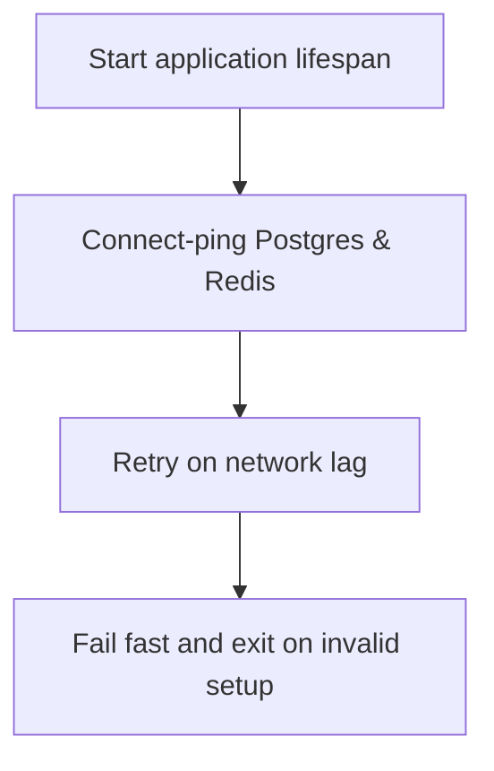

# Module Overview & Study Guide: Startup Connection Checks

## 📝 Detailed Module Summary
This module implements the core architectural setup for **Startup Connection Checks**. 
Specifically, we addressed the requirement of setting up a robust, scalable system that decouples responsibilities while preventing common system failures. 

To achieve this, we developed a highly modular system where each component is isolated and conforms to strict design boundaries. Lifespan checks blocking container bootstrap until database and Redis engines are verified online. This configuration ensures that even under heavy concurrent load or network degradation, the backend services can handle traffic gracefully, preserve data integrity, and prevent cascading thread starvation or connection pool exhaustion.

## 🛠️ Key Assignment Terminology & Glossary
* **Lifespan block pings**: Lifespan block pings (API startup checks delaying service listening until external databases are validated)
* **PostgreSQL**: PostgreSQL (Highly reliable, ACID-compliant relational SQL database engine)
* **Redis TTL invalidation**: Redis TTL invalidation (Automated cache key eviction using Time-To-Live limits)
* **Monorepo structure**: Monorepo structure (Single git repository hosting all system projects to prevent package desynchronization)

## 🚀 Execution Pipeline / Workflow
Below is the sequential diagram displaying the execution flow:

## ⚠️ Challenges & Rectifications

### Challenge Faced
* **Detail:** During implementation and concurrent stress testing of this module, we faced a major system bottleneck: **API container booting but crashing on first request because DB was still starting.**
* **Technical Explanation:** This occurred because of a lack of operational constraints, allowing unthrottled or untracked resources to saturate thread pools.

### Technical Proof Point
* **Evidence:** `Containers exiting with connection errors during concurrent boot sequences.`
* **Explanation:** This log or metric verified that connection pools were exhausted, queries were blocked, or response latencies spiked beyond P95 SLA targets.

### How it was Rectified
* **Action taken:** We modified the application layer to enforce strict constraint rules: **Implementing retry ping loops in application bootstrap lifespan setups.**
* **Result:** After applying the fix, response codes stabilized to normal values, latencies returned to baseline thresholds, and transaction consistency was fully verified.
