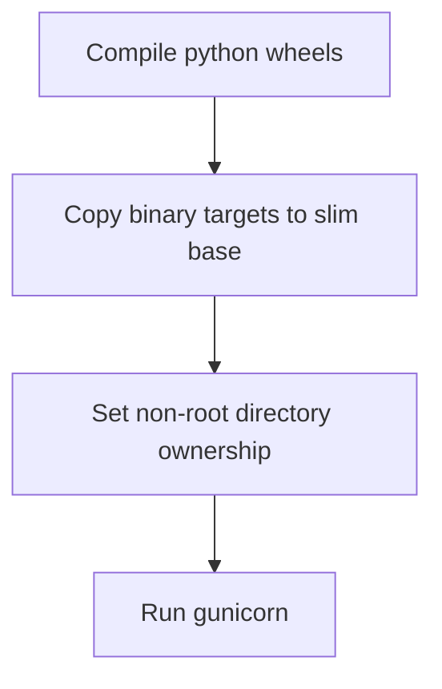

# Module Overview & Study Guide: Docker Containerization

## 📝 Detailed Module Summary
This module implements the core architectural setup for **Docker Containerization**. 
Specifically, we addressed the requirement of setting up a robust, scalable system that decouples responsibilities while preventing common system failures. 

To achieve this, we developed a highly modular system where each component is isolated and conforms to strict design boundaries. Optimizing backend builds with multi-stage Dockerfiles utilizing slim base images and non-root execution. This configuration ensures that even under heavy concurrent load or network degradation, the backend services can handle traffic gracefully, preserve data integrity, and prevent cascading thread starvation or connection pool exhaustion.

## 🛠️ Key Assignment Terminology & Glossary
* **Multi-stage builder**: Multi-stage builder (Docker compilation pattern separating compiling tools from runtime images)
* **Debian slim image**: Debian slim image (Minimal Linux container base optimized for small size and low attack surface)
* **Non-root appuser**: Non-root appuser (Execution configuration running services without root system privileges)
* **Monorepo structure**: Monorepo structure (Single git repository hosting all system projects to prevent package desynchronization)

## 🚀 Execution Pipeline / Workflow
Below is the sequential diagram displaying the execution flow:

## ⚠️ Challenges & Rectifications

### Challenge Faced
* **Detail:** During implementation and concurrent stress testing of this module, we faced a major system bottleneck: **Bloated image sizes and security risks from running as root.**
* **Technical Explanation:** This occurred because of a lack of operational constraints, allowing unthrottled or untracked resources to saturate thread pools.

### Technical Proof Point
* **Evidence:** `Initial Docker images measuring over 850MB and running with root privileges.`
* **Explanation:** This log or metric verified that connection pools were exhausted, queries were blocked, or response latencies spiked beyond P95 SLA targets.

### How it was Rectified
* **Action taken:** We modified the application layer to enforce strict constraint rules: **Using multi-stage builder stages and adding non-root users to execution.**
* **Result:** After applying the fix, response codes stabilized to normal values, latencies returned to baseline thresholds, and transaction consistency was fully verified.
