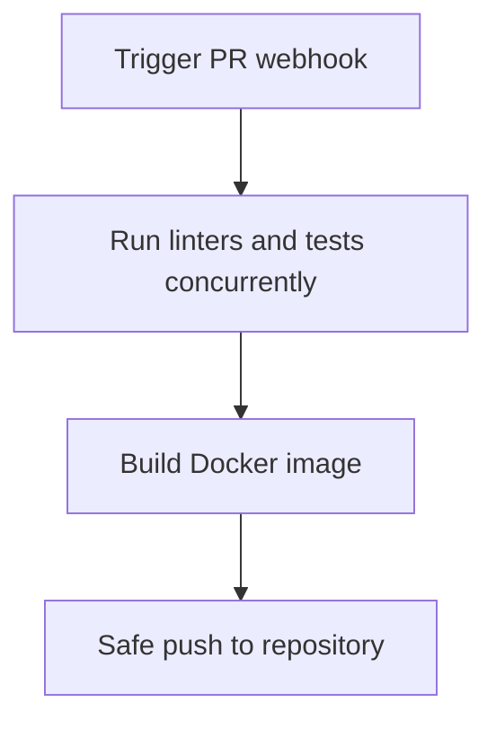

# Module Overview & Study Guide: CI/CD Pipeline Gating

## 📝 Detailed Module Summary
This module implements the core architectural setup for **CI/CD Pipeline Gating**. 
Specifically, we addressed the requirement of setting up a robust, scalable system that decouples responsibilities while preventing common system failures. 

To achieve this, we developed a highly modular system where each component is isolated and conforms to strict design boundaries. Automating workflow tests and checking formatting constraints in parallel before merging branches. This configuration ensures that even under heavy concurrent load or network degradation, the backend services can handle traffic gracefully, preserve data integrity, and prevent cascading thread starvation or connection pool exhaustion.

## 🛠️ Key Assignment Terminology & Glossary
* **GitHub Actions workflows**: GitHub Actions workflows (Continuous Integration automation runner gating pull requests)
* **Multi-stage builder**: Multi-stage builder (Docker compilation pattern separating compiling tools from runtime images)
* **PostgreSQL**: PostgreSQL (Highly reliable, ACID-compliant relational SQL database engine)
* **CI/CD**: CI/CD

## 🚀 Execution Pipeline / Workflow
Below is the sequential diagram displaying the execution flow:

## ⚠️ Challenges & Rectifications

### Challenge Faced
* **Detail:** During implementation and concurrent stress testing of this module, we faced a major system bottleneck: **Secret credentials leaks and slow execution queues during workflow runs.**
* **Technical Explanation:** This occurred because of a lack of operational constraints, allowing unthrottled or untracked resources to saturate thread pools.

### Technical Proof Point
* **Evidence:** `Credential parameters printed in raw pipeline workflow log views.`
* **Explanation:** This log or metric verified that connection pools were exhausted, queries were blocked, or response latencies spiked beyond P95 SLA targets.

### How it was Rectified
* **Action taken:** We modified the application layer to enforce strict constraint rules: **Configuring parallel execution jobs and masking registry credentials using GitHub Secrets.**
* **Result:** After applying the fix, response codes stabilized to normal values, latencies returned to baseline thresholds, and transaction consistency was fully verified.
