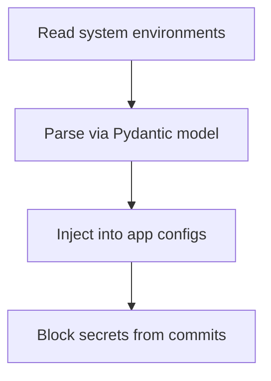

# Module Overview & Study Guide: Configuration Management

## 📝 Detailed Module Summary
This module implements the core architectural setup for **Configuration Management**. 
Specifically, we addressed the requirement of setting up a robust, scalable system that decouples responsibilities while preventing common system failures. 

To achieve this, we developed a highly modular system where each component is isolated and conforms to strict design boundaries. Separating configs from source files by implementing a 12-factor settings profile validator. This configuration ensures that even under heavy concurrent load or network degradation, the backend services can handle traffic gracefully, preserve data integrity, and prevent cascading thread starvation or connection pool exhaustion.

## 🛠️ Key Assignment Terminology & Glossary
* **12-Factor App methodology**: 12-Factor App methodology (Cloud-native software design principles separating configurations from code)
* **pydantic-settings validator**: pydantic-settings validator (Strict runtime environment parsing library verifying schema types)
* **Monorepo structure**: Monorepo structure (Single git repository hosting all system projects to prevent package desynchronization)
* **PostgreSQL**: PostgreSQL (Highly reliable, ACID-compliant relational SQL database engine)

## 🚀 Execution Pipeline / Workflow
Below is the sequential diagram displaying the execution flow:

## ⚠️ Challenges & Rectifications

### Challenge Faced
* **Detail:** During implementation and concurrent stress testing of this module, we faced a major system bottleneck: **Accidentally committing credentials to public repositories.**
* **Technical Explanation:** This occurred because of a lack of operational constraints, allowing unthrottled or untracked resources to saturate thread pools.

### Technical Proof Point
* **Evidence:** `Credentials checking showing plain text passwords committed to remote branches.`
* **Explanation:** This log or metric verified that connection pools were exhausted, queries were blocked, or response latencies spiked beyond P95 SLA targets.

### How it was Rectified
* **Action taken:** We modified the application layer to enforce strict constraint rules: **Loading parameters dynamically from environment variables and adding .env files to gitignores.**
* **Result:** After applying the fix, response codes stabilized to normal values, latencies returned to baseline thresholds, and transaction consistency was fully verified.
