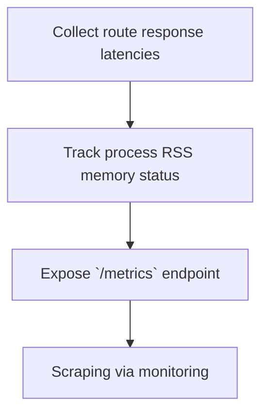

# Module Overview & Study Guide: Observability & Metrics

## 📝 Detailed Module Summary
This module implements the core architectural setup for **Observability & Metrics**. 
Specifically, we addressed the requirement of setting up a robust, scalable system that decouples responsibilities while preventing common system failures. 

To achieve this, we developed a highly modular system where each component is isolated and conforms to strict design boundaries. Instrumenting applications with custom Prometheus metrics scrapers and process memory metrics. This configuration ensures that even under heavy concurrent load or network degradation, the backend services can handle traffic gracefully, preserve data integrity, and prevent cascading thread starvation or connection pool exhaustion.

## 🛠️ Key Assignment Terminology & Glossary
* **Prometheus gauges**: Prometheus gauges (Continuous numeric metrics collectors reporting real-time system stats)
* **RSS memory monitoring**: RSS memory monitoring (Resident Set Size tracking indicating memory usage in RAM)
* **P95/P99 latency**: P95/P99 latency (The performance threshold within which 95% or 99% of requests complete)
* **Structured JSON format**: Structured JSON format

## 🚀 Execution Pipeline / Workflow
Below is the sequential diagram displaying the execution flow:

## ⚠️ Challenges & Rectifications

### Challenge Faced
* **Detail:** During implementation and concurrent stress testing of this module, we faced a major system bottleneck: **Memory leaks causing processes to crash silently without alerting triggers.**
* **Technical Explanation:** This occurred because of a lack of operational constraints, allowing unthrottled or untracked resources to saturate thread pools.

### Technical Proof Point
* **Evidence:** `API processes crashing on Out-Of-Memory limits under concurrency.`
* **Explanation:** This log or metric verified that connection pools were exhausted, queries were blocked, or response latencies spiked beyond P95 SLA targets.

### How it was Rectified
* **Action taken:** We modified the application layer to enforce strict constraint rules: **Adding gauge collections that track RSS memory limits directly from host status fields.**
* **Result:** After applying the fix, response codes stabilized to normal values, latencies returned to baseline thresholds, and transaction consistency was fully verified.
