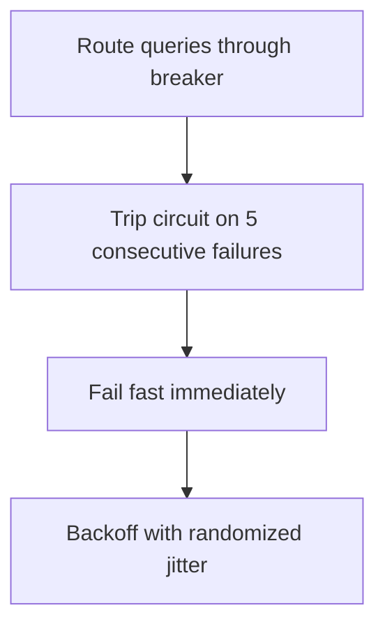

# Module Overview & Study Guide: Circuit Breakers & Jittered Retries

## 📝 Detailed Module Summary
This module implements the core architectural setup for **Circuit Breakers & Jittered Retries**. 
Specifically, we addressed the requirement of setting up a robust, scalable system that decouples responsibilities while preventing common system failures. 

To achieve this, we developed a highly modular system where each component is isolated and conforms to strict design boundaries. Protecting backend engines from retry storms using circuit breakers and randomized exponential jitters. This configuration ensures that even under heavy concurrent load or network degradation, the backend services can handle traffic gracefully, preserve data integrity, and prevent cascading thread starvation or connection pool exhaustion.

## 🛠️ Key Assignment Terminology & Glossary
* **pybreaker logic**: pybreaker logic (Circuit breaker utility tripping requests during dependency dropouts)
* **PostgreSQL**: PostgreSQL (Highly reliable, ACID-compliant relational SQL database engine)
* **P95/P99 latency**: P95/P99 latency (The performance threshold within which 95% or 99% of requests complete)
* **Layered architecture**: Layered architecture (Design pattern decoupling business rules from interface controllers)

## 🚀 Execution Pipeline / Workflow
Below is the sequential diagram displaying the execution flow:

## ⚠️ Challenges & Rectifications

### Challenge Faced
* **Detail:** During implementation and concurrent stress testing of this module, we faced a major system bottleneck: **Retry storms degrading databases during short connection outages.**
* **Technical Explanation:** This occurred because of a lack of operational constraints, allowing unthrottled or untracked resources to saturate thread pools.

### Technical Proof Point
* **Evidence:** `API threads repeatedly calling a down database, prolonging recovery.`
* **Explanation:** This log or metric verified that connection pools were exhausted, queries were blocked, or response latencies spiked beyond P95 SLA targets.

### How it was Rectified
* **Action taken:** We modified the application layer to enforce strict constraint rules: **Integrating pybreakers and applying exponential delay backoffs with random jitters.**
* **Result:** After applying the fix, response codes stabilized to normal values, latencies returned to baseline thresholds, and transaction consistency was fully verified.
