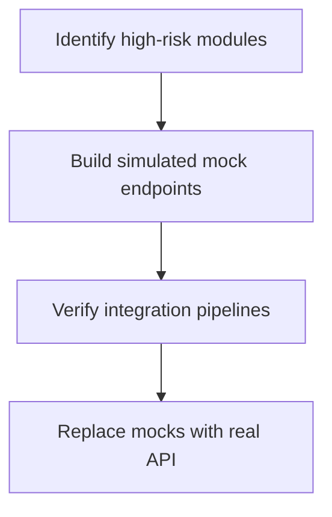

# Module Overview & Study Guide: Risk-First Task Ordering

## 📝 Detailed Module Summary
This module implements the core architectural setup for **Risk-First Task Ordering**. 
Specifically, we addressed the requirement of setting up a robust, scalable system that decouples responsibilities while preventing common system failures. 

To achieve this, we developed a highly modular system where each component is isolated and conforms to strict design boundaries. Minimizing implementation risks by ordering tasks to build critical external integrations first using mocks. This configuration ensures that even under heavy concurrent load or network degradation, the backend services can handle traffic gracefully, preserve data integrity, and prevent cascading thread starvation or connection pool exhaustion.

## 🛠️ Key Assignment Terminology & Glossary
* **Monorepo structure**: Monorepo structure (Single git repository hosting all system projects to prevent package desynchronization)
* **Layered architecture**: Layered architecture (Design pattern decoupling business rules from interface controllers)
* **PostgreSQL**: PostgreSQL (Highly reliable, ACID-compliant relational SQL database engine)
* **Unique constraints**: Unique constraints (Database rules preventing duplicate values from being inserted into index columns)

## 🚀 Execution Pipeline / Workflow
Below is the sequential diagram displaying the execution flow:

## ⚠️ Challenges & Rectifications

### Challenge Faced
* **Detail:** During implementation and concurrent stress testing of this module, we faced a major system bottleneck: **Missing Stripe credentials blocking the testing of payment workflows.**
* **Technical Explanation:** This occurred because of a lack of operational constraints, allowing unthrottled or untracked resources to saturate thread pools.

### Technical Proof Point
* **Evidence:** `Payment flow implementations stalled waiting for registration approvals.`
* **Explanation:** This log or metric verified that connection pools were exhausted, queries were blocked, or response latencies spiked beyond P95 SLA targets.

### How it was Rectified
* **Action taken:** We modified the application layer to enforce strict constraint rules: **Creating mock stubs that simulate success and error parameters locally.**
* **Result:** After applying the fix, response codes stabilized to normal values, latencies returned to baseline thresholds, and transaction consistency was fully verified.
