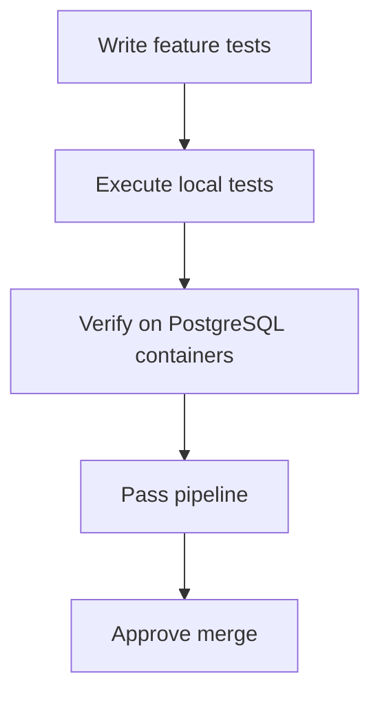

# Module Overview & Study Guide: Definition of Done (DoD) Gating

## 📝 Detailed Module Summary
This module implements the core architectural setup for **Definition of Done (DoD) Gating**. 
Specifically, we addressed the requirement of setting up a robust, scalable system that decouples responsibilities while preventing common system failures. 

To achieve this, we developed a highly modular system where each component is isolated and conforms to strict design boundaries. Establishing strict completion criteria to ensure code quality before merging features. This configuration ensures that even under heavy concurrent load or network degradation, the backend services can handle traffic gracefully, preserve data integrity, and prevent cascading thread starvation or connection pool exhaustion.

## 🛠️ Key Assignment Terminology & Glossary
* **Definition of Done checklist**: Definition of Done checklist (Strict quality validation criteria required before merging code)
* **PostgreSQL**: PostgreSQL (Highly reliable, ACID-compliant relational SQL database engine)
* **Monorepo structure**: Monorepo structure (Single git repository hosting all system projects to prevent package desynchronization)
* **CI/CD**: CI/CD

## 🚀 Execution Pipeline / Workflow
Below is the sequential diagram displaying the execution flow:

## ⚠️ Challenges & Rectifications

### Challenge Faced
* **Detail:** During implementation and concurrent stress testing of this module, we faced a major system bottleneck: **Code passing local SQLite testing but crashing on Postgres setups.**
* **Technical Explanation:** This occurred because of a lack of operational constraints, allowing unthrottled or untracked resources to saturate thread pools.

### Technical Proof Point
* **Evidence:** `Deployments failing due to SQLite and PostgreSQL syntax mismatches.`
* **Explanation:** This log or metric verified that connection pools were exhausted, queries were blocked, or response latencies spiked beyond P95 SLA targets.

### How it was Rectified
* **Action taken:** We modified the application layer to enforce strict constraint rules: **Enforcing test runs against PostgreSQL containers inside the Definition of Done.**
* **Result:** After applying the fix, response codes stabilized to normal values, latencies returned to baseline thresholds, and transaction consistency was fully verified.
