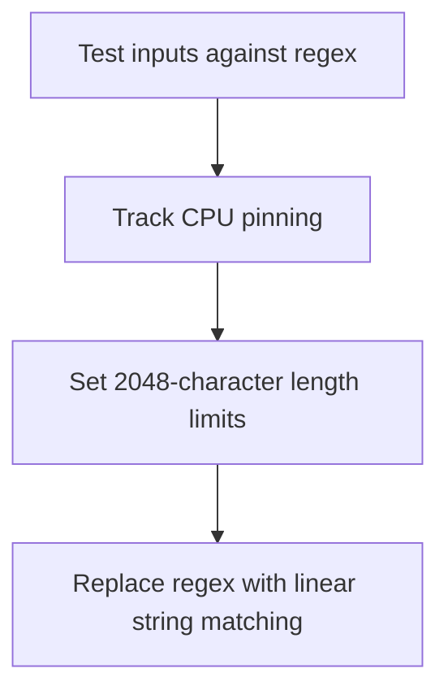

# Module Overview & Study Guide: ReDoS Protection

## 📝 Detailed Module Summary
This module implements the core architectural setup for **ReDoS Protection**. 
Specifically, we addressed the requirement of setting up a robust, scalable system that decouples responsibilities while preventing common system failures. 

To achieve this, we developed a highly modular system where each component is isolated and conforms to strict design boundaries. Hardening inputs against Regular Expression Denial of Service (ReDoS) backtracking attacks. This configuration ensures that even under heavy concurrent load or network degradation, the backend services can handle traffic gracefully, preserve data integrity, and prevent cascading thread starvation or connection pool exhaustion.

## 🛠️ Key Assignment Terminology & Glossary
* **Catastrophic regex backtracking**: Catastrophic regex backtracking (CPU starvation loops caused by nested wildcards in regex engines)
* **Monorepo structure**: Monorepo structure (Single git repository hosting all system projects to prevent package desynchronization)
* **Layered architecture**: Layered architecture (Design pattern decoupling business rules from interface controllers)
* **slowapi rate limiting**: slowapi rate limiting (FastAPI rate limit middleware capping client request frequencies)

## 🚀 Execution Pipeline / Workflow
Below is the sequential diagram displaying the execution flow:

## ⚠️ Challenges & Rectifications

### Challenge Faced
* **Detail:** During implementation and concurrent stress testing of this module, we faced a major system bottleneck: **Regex backtracking allowing malicious inputs to lock up the API.**
* **Technical Explanation:** This occurred because of a lack of operational constraints, allowing unthrottled or untracked resources to saturate thread pools.

### Technical Proof Point
* **Evidence:** `Malicious inputs with trailing characters causing CPU usage spikes.`
* **Explanation:** This log or metric verified that connection pools were exhausted, queries were blocked, or response latencies spiked beyond P95 SLA targets.

### How it was Rectified
* **Action taken:** We modified the application layer to enforce strict constraint rules: **Rejecting inputs exceeding 2048 characters and using linear string matching.**
* **Result:** After applying the fix, response codes stabilized to normal values, latencies returned to baseline thresholds, and transaction consistency was fully verified.
