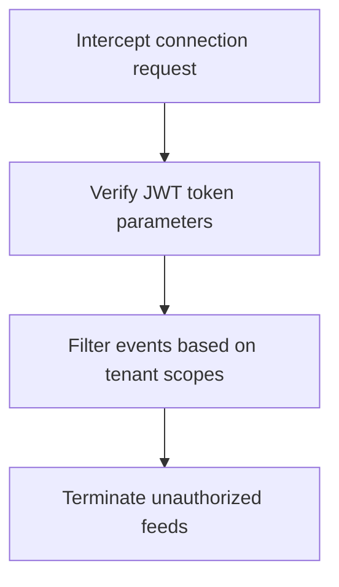

# Module Overview & Study Guide: WebSocket Security Scoping

## 📝 Detailed Module Summary
This module implements the core architectural setup for **WebSocket Security Scoping**. 
Specifically, we addressed the requirement of setting up a robust, scalable system that decouples responsibilities while preventing common system failures. 

To achieve this, we developed a highly modular system where each component is isolated and conforms to strict design boundaries. Securing persistent WebSocket feeds by verifying JWT access and segmenting event broadcasts. This configuration ensures that even under heavy concurrent load or network degradation, the backend services can handle traffic gracefully, preserve data integrity, and prevent cascading thread starvation or connection pool exhaustion.

## 🛠️ Key Assignment Terminology & Glossary
* **WebSocket handshake verification**: WebSocket handshake verification (Security validation checking token headers before spawning TCP feeds)
* **Stateless JWT verification**: Stateless JWT verification (Cryptographic user session validation bypassing database checks)
* **Monorepo structure**: Monorepo structure (Single git repository hosting all system projects to prevent package desynchronization)
* **Layered architecture**: Layered architecture (Design pattern decoupling business rules from interface controllers)

## 🚀 Execution Pipeline / Workflow
Below is the sequential diagram displaying the execution flow:

## ⚠️ Challenges & Rectifications

### Challenge Faced
* **Detail:** During implementation and concurrent stress testing of this module, we faced a major system bottleneck: **WebSocket event broadcasts leaking private metrics to other teams.**
* **Technical Explanation:** This occurred because of a lack of operational constraints, allowing unthrottled or untracked resources to saturate thread pools.

### Technical Proof Point
* **Evidence:** `Tenants receiving event payloads containing other team IDs.`
* **Explanation:** This log or metric verified that connection pools were exhausted, queries were blocked, or response latencies spiked beyond P95 SLA targets.

### How it was Rectified
* **Action taken:** We modified the application layer to enforce strict constraint rules: **Verifying JWT scopes on handshake and filtering broadcast queues.**
* **Result:** After applying the fix, response codes stabilized to normal values, latencies returned to baseline thresholds, and transaction consistency was fully verified.
