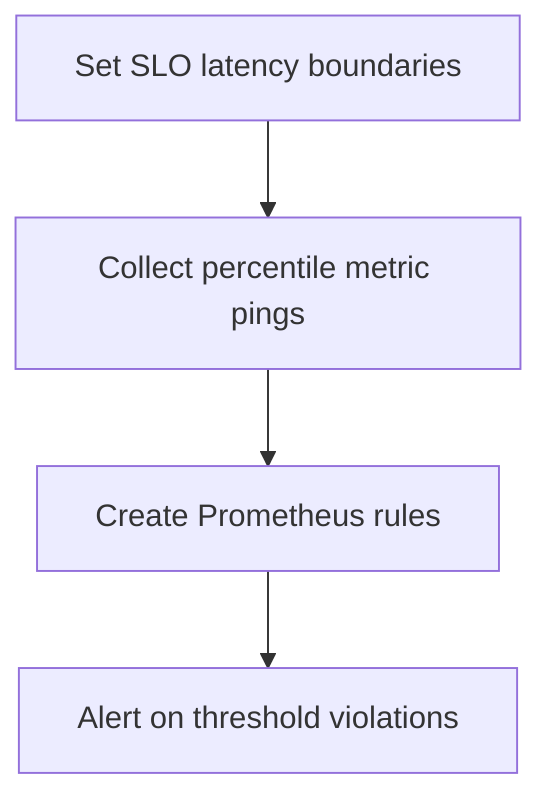

# Module Overview & Study Guide: SLA & Latency Monitoring

## 📝 Detailed Module Summary
This module implements the core architectural setup for **SLA & Latency Monitoring**. 
Specifically, we addressed the requirement of setting up a robust, scalable system that decouples responsibilities while preventing common system failures. 

To achieve this, we developed a highly modular system where each component is isolated and conforms to strict design boundaries. Configuring performance alert rules targeting P95 and P99 latency percentiles. This configuration ensures that even under heavy concurrent load or network degradation, the backend services can handle traffic gracefully, preserve data integrity, and prevent cascading thread starvation or connection pool exhaustion.

## 🛠️ Key Assignment Terminology & Glossary
* **SLIs/SLOs monitoring**: SLIs/SLOs monitoring (Service Level Indicators/Objectives defining performance expectations)
* **P95/P99 latency**: P95/P99 latency (The performance threshold within which 95% or 99% of requests complete)
* **Prometheus gauges**: Prometheus gauges (Continuous numeric metrics collectors reporting real-time system stats)
* **Monorepo structure**: Monorepo structure (Single git repository hosting all system projects to prevent package desynchronization)

## 🚀 Execution Pipeline / Workflow
Below is the sequential diagram displaying the execution flow:

## ⚠️ Challenges & Rectifications

### Challenge Faced
* **Detail:** During implementation and concurrent stress testing of this module, we faced a major system bottleneck: **Global average latency masking performance degradation.**
* **Technical Explanation:** This occurred because of a lack of operational constraints, allowing unthrottled or untracked resources to saturate thread pools.

### Technical Proof Point
* **Evidence:** `Database bottlenecks going unnoticed because averages remained stable.`
* **Explanation:** This log or metric verified that connection pools were exhausted, queries were blocked, or response latencies spiked beyond P95 SLA targets.

### How it was Rectified
* **Action taken:** We modified the application layer to enforce strict constraint rules: **Configuring Prometheus alerting triggers on P95 and P99 latencies.**
* **Result:** After applying the fix, response codes stabilized to normal values, latencies returned to baseline thresholds, and transaction consistency was fully verified.
